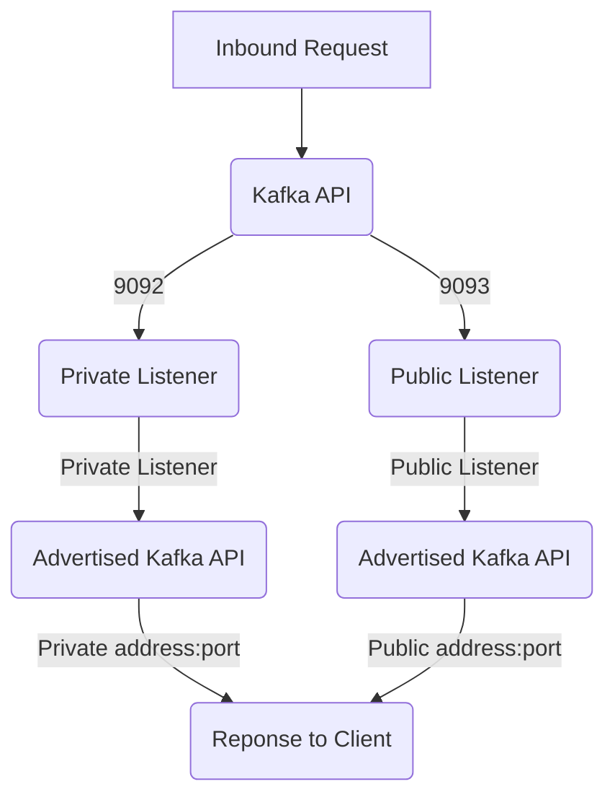

# More stuff I'm figuring out about Listeners


**First and foremost, you should be aware that EC2 may nat your public IP to the private IP, which can complicate your world.**

# General Kafka API Operation

(the admin API works identically, just replace "admin api" with "kafka api" and everything applies in the same fashion.

When a request comes in, it routes to the `kafka_api:` listener, and then returns the broker addresses found in the `advertised_kafka_api:` section.  

## Single Listener

Inbound traffic will route to a listener.   The basic case is binding the `kafka_api` listener to `0.0.0.0` which theoretically means all inbound traffic.  The default config is for a single listener.


## Multiple Listeners

Using the `- name:` key will partition off multiple listeners & tie them together across sections.

* Inbound traffic will route to a specific `kafka_api` listener based on the inbound `IP:port`.
* In the yaml below, the `kafka_api` has a "public" and "private" listener.
  * The public listener is on port 9093, so  traffic comimg in on `10.100.7.153:9093` will route to the public listener.
* The reponse will come back with the brokers found in the corresponding listener (that is, "public" in this case) in the `advertised_kafka_api` section.

_AWS/EC2 caveat:_  traffic coming in on the public IP gets NAT'd to the private IP, so using the _public_ IP here might not work as expected, depending on a bunch of ENI & other networking factors.




### A simple example

_(Ignoring TLS for the moment)_

1.  Traffic comes in from `10.100.7.153:9093`

2.  This address:port is bound to the `kafka_api` PUBLIC listener. 

3.  The flow will use the listener identified in step #2 throughout.

4.  Next it will look at the `advertised_kafka_api` section and find the PUBLIC listener.

5.  The reponse is the address & port corresponding to the PUBLIC listener (there will be multiple addresses/ports in the case of an actual cluster)  ==> `3.17.174.176:9093`


### A TLS Example

If there is a TLS section (i.e. `kafka_api_tls`), the listener will expect traffic to correspond to the settings therein, corresponding to the listener being used.   So in the above example...

1.  Traffic comes in from `10.100.7.153:9093`

2.  This address:port is bound to the `kafka_api` PUBLIC listener. 

3.  The flow will use the listener identified in step #2 throughout.

4.  Next it will check if there is a TLS listener in `kafka_api_tls`, check if it is enabled, and then validate if the inbound traffic is correctly TLS enabled/disabled.  In this example, TLS is enabled for the PUBLIC listener.

5.  Next it will look at the `advertised_kafka_api` section and find the PUBLIC listener.

6.  The reponse is the address & port corresponding to the PUBLIC listener (there will be multiple addresses/ports in the case of an actual cluster)  ==> `3.17.174.176:9093`


Note that the `kafka_api_tls` listeners are defined such that public traffic requires TLS while private traffic does not require TLS.


# Reference `redpanda.yaml`

```yaml
redpanda:
    data_directory: /var/lib/redpanda/data
    empty_seed_starts_cluster: false
    seed_servers:
        - host:
            address: 10.100.7.153
            port: 33145
    rpc_server:
        address: 0.0.0.0
        port: 33145
    kafka_api:
        - address: 10.100.7.153
          port: 9093
          name: public
        - address: 10.100.7.153
          port: 9092
          name: private

    kafka_api_tls:
        - name: public
          enabled: true
          require_client_auth: true
          key_file: /etc/redpanda/certs/broker.key
          cert_file: /etc/redpanda/certs/broker.crt
          truststore_file: /etc/redpanda/certs/ca.crt

        - name: private
          enabled: false
          require_client_auth: false
            #key_file: /etc/redpanda/certs/broker.key
            #cert_file: /etc/redpanda/certs/broker.crt
            #truststore_file: /etc/redpanda/certs/ca.crt
    admin:
          address: 0.0.0.0
          port: 9644
    admin_api_tls:
          enabled: true
          require_client_auth: true
          key_file: /etc/redpanda/certs/broker.key
          cert_file: /etc/redpanda/certs/broker.crt
          truststore_file: /etc/redpanda/certs/ca.crt

    advertised_kafka_api:
      - address: 3.17.174.176
        port: 9093
        name: public
      - address: 10.100.7.153
        port: 9092
        name: private

    advertised_rpc_api:
        address: 10.100.7.153
        port: 33145

    developer_mode: true
    auto_create_topics_enabled: true
    fetch_reads_debounce_timeout: 10
    group_initial_rebalance_delay: 0
    group_topic_partitions: 3
    log_segment_size_min: 1
    storage_min_free_bytes: 10485760
    topic_partitions_per_shard: 1000
    write_caching_default: "true"
rpk:
    kafka_api:
      #tls:
      #enabled: false
      #ca_file: /etc/redpanda/certs/ca.crt
    admin_api:
      tls:
          key_file: /etc/redpanda/certs/broker.key
          cert_file: /etc/redpanda/certs/broker.crt
          truststore_file: /etc/redpanda/certs/ca.crt
    overprovisioned: true

pandaproxy: {}
schema_registry: {}
```


