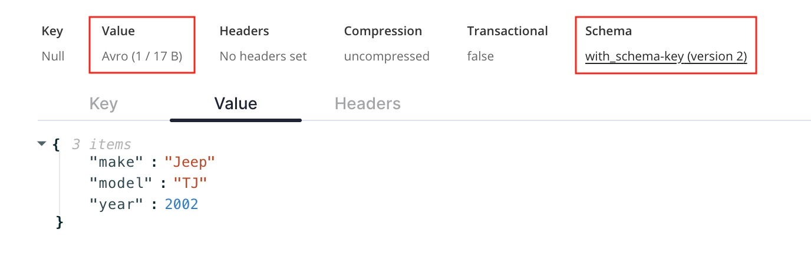
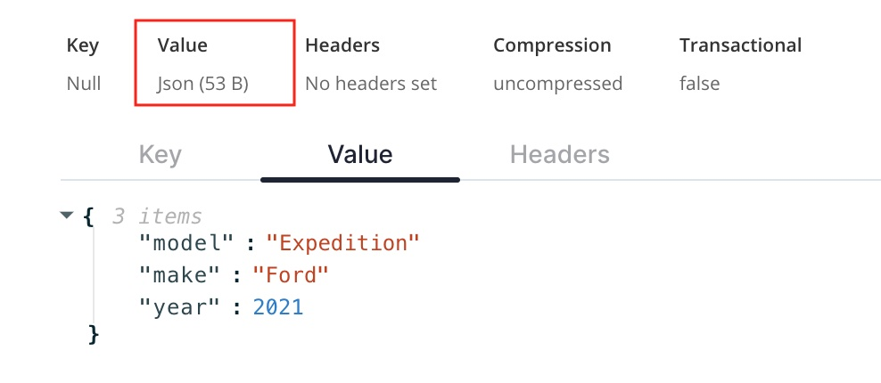

If you have a schema already created, you can test it using rpk.   Note that a 


### Use a schema
`rpk topic produce with_schema --schema-id=1`

```
{"model": "TJ", "make": "Jeep", "year": 2002}
Produced to partition 0 at offset 5 with timestamp 1707238159301.
```


### Don't use a schema
`rpk topic produce with_schema`

```
{"model": "Expedition", "make": "Ford", "year": 2021}
Produced to partition 0 at offset 6 with timestamp 1707238349368.
```

### Message doesn't adhere to schema
`rpk topic produce with_schema --schema-id=1`

```
{"stuff": "foo", "etc": "bar"}
unable to encode value: unable to parse record with the provided schema: cannot decode textual record "car": cannot decode textual map: cannot determine codec: "stuff"
```

### Use the wrong schema
`rpk topic produce with_schema --schema-id=2`

```
{"model": "TJ", "make": "Jeep", "year": 2002}
unable to encode value: unable to parse record with the provided schema: cannot decode textual record "guitar": cannot decode textual map: cannot determine codec: "model"
```

### Use a schema, but message doesn't adhere to it
`rpk topic produce with_schema --schema-id=1`

```
test no schema
record read error: invalid input 'e'
```

## Chceking in Console

From a quick glance it isn't immediately obvious that a message is avro or json.  If you drill into the message itself, you can see the schema type & ID that was used on that message.




